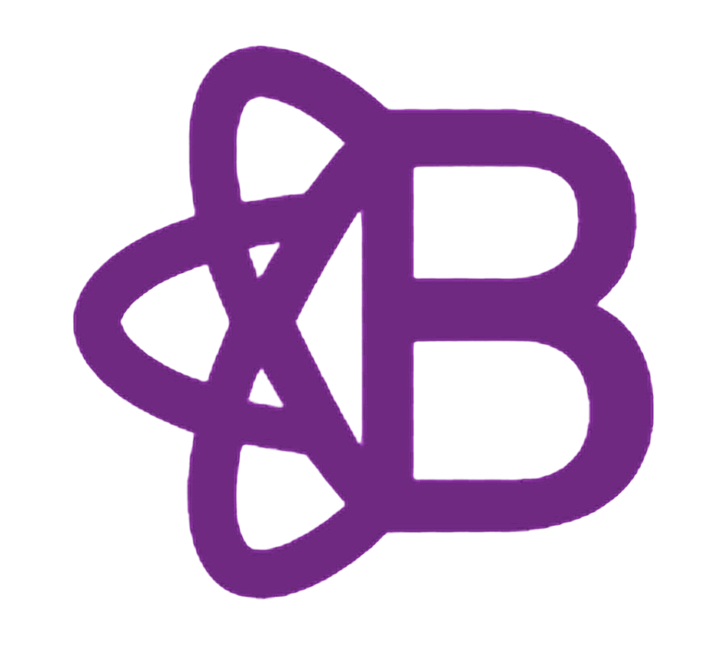

# Desarrollo Web con React + Vite + Bootstrap

## Grupo Q - UTN - Argentina Programa 4.0

Ejercicios utilizando las siguientes tecnologías y estructuras:

- Proyecto creado con Vite

  

- Archivo principal: `App.jsx`
- Estilado con React-bootstrap, el cual tiene verdaderos componentes de React creados desde cero. La biblioteca es compatible con el núcleo de Bootstrap.
  **Click en el Logo para ver componenetes**

<p align="center">
  <a href="https://react-bootstrap.netlify.app/docs/components/accordion" target="_blank" rel="noreferrer">
    
  </a>
</p>

### Requisitos previos

Antes de comenzar, asegurarse de tener instalado Node.js en la máquina. Para verificar esto ejecutar el siguiente comando en terminal:

```
    node --version
```

### Paso 1: Clonar el proyecto

1.  Abrir la terminal y navegar hasta el directorio en el que desean clonar el proyecto:

```
    git clone https://github.com/CrysG011/EquipoQ/tree/master/ejercicios/pagina-registro
```

2.  Entrar al directorio del proyecto:

```
    cd <nombre-del-proyecto>
```

### Paso 2: Instalar todas las dependencias incluida React-bootstrap

```
    npm install
```

### Paso 3: Iniciar el servidor de desarrollo

```
    npm run dev
```
